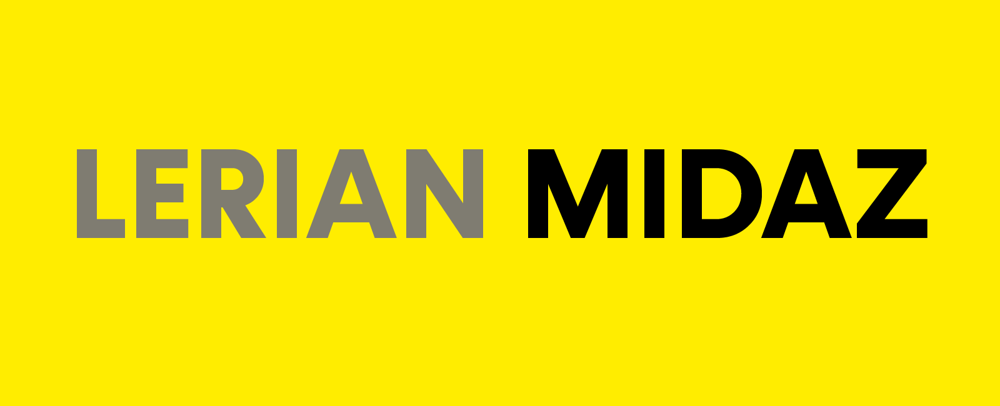

<div align="center">

[](https://github.com/LerianStudio/midaz-sdk-golang/releases)
[](https://goreportcard.com/report/github.com/lerianstudio/midaz-sdk-golang)
[](https://discord.gg/DnhqKwkGv3)
[](https://golang.org/)
[](LICENSE.md)

</div>

# Midaz Go SDK

The Midaz Go SDK is an idiomatic Go client for the Midaz financial ledger APIs. It exposes entity services for Ledger resources, CRM holders and aliases, structured errors, explicit configuration, retries, pagination helpers, concurrency utilities, and OpenTelemetry observability.

## Features

- **Current Midaz API coverage**: Ledger resources plus CRM holders, aliases, and MetadataIndexes.
- **Entity service API**: Access services through `c.Entity.<Service>` with explicit methods such as `CreateOrganization`, `ListAccounts`, and `CreateTransactionWithDSL`.
- **Functional options**: Configure clients with `client.WithConfig`, `client.WithBaseURL`, `client.WithRetries`, `client.WithObservabilityProvider`, and related options.
- **Access Manager authentication**: Configure plugin authentication with `auth.AccessManager` and `config.WithAccessManager` or environment variables.
- **Structured errors**: Use `pkg/errors` categories, codes, helper checkers, status accessors, and request/resource context.
- **Retries and idempotency**: Built-in retry behavior for transient failures, with idempotency-aware retries for unsafe requests.
- **Pagination**: `models.ListOptions`, `models.ListResponse[T]`, and pagination metadata helpers.
- **Observability**: OpenTelemetry tracing propagation, metrics, logging, and middleware helpers.
- **Concurrency utilities**: Worker pools, batching, and rate limiting in `pkg/concurrent`.

## Installation

```bash
go get github.com/LerianStudio/midaz-sdk-golang/v2
```

## Quick start

```go
package main

import (
    "context"
    "fmt"
    "log"

    client "github.com/LerianStudio/midaz-sdk-golang/v2"
    "github.com/LerianStudio/midaz-sdk-golang/v2/models"
    "github.com/LerianStudio/midaz-sdk-golang/v2/pkg/config"
)

func main() {
    cfg, err := config.NewConfig(config.FromEnvironment())
    if err != nil {
        log.Fatalf("failed to create config: %v", err)
    }

    c, err := client.New(
        client.WithConfig(cfg),
        client.UseAllAPIs(),
    )
    if err != nil {
        log.Fatalf("failed to create client: %v", err)
    }
    defer c.Shutdown(context.Background())

    ctx := context.Background()
    orgInput := models.NewCreateOrganizationInput("Example Corporation", "123456789").
        WithDoingBusinessAs("Example Inc.").
        WithAddress(models.Address{
            Line1:   "123 Main St",
            City:    "New York",
            State:   "NY",
            ZipCode: "10001",
            Country: "US",
        })

    org, err := c.Entity.Organizations.CreateOrganization(ctx, orgInput)
    if err != nil {
        log.Fatalf("failed to create organization: %v", err)
    }

    fmt.Printf("organization created: %s\n", org.ID)
}
```

`config.FromEnvironment()` is explicit. Environment variables are not loaded unless you pass that option to `config.NewConfig`.

## Client configuration

### Environment-based configuration

```go
cfg, err := config.NewConfig(config.FromEnvironment())
if err != nil {
    return err
}

c, err := client.New(
    client.WithConfig(cfg),
    client.UseAllAPIs(),
)
```

### Access Manager configuration

```go
import auth "github.com/LerianStudio/midaz-sdk-golang/v2/pkg/access-manager"

accessManager := auth.AccessManager{
    Enabled:      true,
    Address:      "https://your-auth-service.com",
    ClientID:     "your-client-id",
    ClientSecret: "your-client-secret",
}

cfg, err := config.NewConfig(
    config.WithAccessManager(accessManager),
)
if err != nil {
    return err
}

c, err := client.New(
    client.WithConfig(cfg),
    client.UseAllAPIs(),
)
```

Equivalent environment variables:

```bash
PLUGIN_AUTH_ENABLED=true
PLUGIN_AUTH_ADDRESS=https://your-auth-service.com
MIDAZ_CLIENT_ID=your-client-id
MIDAZ_CLIENT_SECRET=your-client-secret
```

### Direct URL configuration

```go
c, err := client.New(
    client.WithBaseURL("http://localhost:3002"),
    client.WithTimeout(30*time.Second),
    client.WithRetries(3, 100*time.Millisecond, 10*time.Second),
    client.UseAllAPIs(),
)
```

## Entity services

Enable entity services with `client.UseAllAPIs()` or `client.UseEntityAPI()`. The current service surface is:

- `Accounts`
- `AccountTypes`
- `Assets`
- `AssetRates`
- `Balances`
- `Holders`
- `Aliases`
- `Ledgers`
- `MetadataIndexes`
- `Operations`
- `OperationRoutes`
- `Organizations`
- `Portfolios`
- `Segments`
- `Transactions`
- `TransactionRoutes`

Example calls:

```go
orgs, err := c.Entity.Organizations.ListOrganizations(ctx, models.NewListOptions().WithLimit(20))
ledger, err := c.Entity.Ledgers.CreateLedger(ctx, orgID, models.NewCreateLedgerInput("Main Ledger"))
account, err := c.Entity.Accounts.GetAccount(ctx, orgID, ledgerID, accountID)
balance, err := c.Entity.Accounts.GetBalance(ctx, orgID, ledgerID, accountID)
holders, err := c.Entity.Holders.ListHolders(ctx, orgID, models.NewListOptions().WithLimit(20))
```

`Accounts.GetBalance` and `Accounts.GetExternalAccountBalance` are convenience helpers for accounts with exactly one balance. Use the `Balances` service list methods when an account can have multiple balances.

## Transactions

The current transaction contract uses a send-based payload:

```go
txInput := models.NewCreateTransactionInput("USD", "100.00").
    WithDescription("Payment from customer to merchant").
    WithSend(&models.SendInput{
        Asset: "USD",
        Value: "100.00",
        Source: &models.SourceInput{
            From: []models.FromToInput{
                {Account: customerAlias, Amount: models.AmountInput{Asset: "USD", Value: "100.00"}},
            },
        },
        Distribute: &models.DistributeInput{
            To: []models.FromToInput{
                {Account: merchantAlias, Amount: models.AmountInput{Asset: "USD", Value: "100.00"}},
            },
        },
    })
txInput.IdempotencyKey = "payment-2026-05-03-0001"

tx, err := c.Entity.Transactions.CreateTransaction(ctx, orgID, ledgerID, txInput)
```

DSL-style structured transactions are available with `CreateTransactionWithDSL`, and raw DSL file content can be sent with `CreateTransactionWithDSLFile`.

## Pagination

```go
options := models.NewListOptions().
    WithLimit(50).
    WithFilter("status", "ACTIVE")

for {
    page, err := c.Entity.Accounts.ListAccounts(ctx, orgID, ledgerID, options)
    if err != nil {
        return err
    }

    for _, account := range page.Items {
        process(account)
    }

    if !page.Pagination.HasNextPage() {
        break
    }

    options = page.Pagination.NextPageOptions()
}
```

See [pagination](docs/pagination.md) for page, cursor, and sorting details.

## Error handling

```go
account, err := c.Entity.Accounts.GetAccount(ctx, orgID, ledgerID, accountID)
if err != nil {
    switch {
    case sdkerrors.IsNotFoundError(err):
        return fmt.Errorf("account not found: %w", err)
    case sdkerrors.IsAuthenticationError(err):
        return fmt.Errorf("authentication failed: %w", err)
    case sdkerrors.IsRateLimitError(err):
        return fmt.Errorf("rate limited: %w", err)
    default:
        return fmt.Errorf("failed to get account: %w", err)
    }
}
```

Import the error package as:

```go
import sdkerrors "github.com/LerianStudio/midaz-sdk-golang/v2/pkg/errors"
```

See [error handling](docs/errors.md) for categories, status accessors, retry boundaries, and validation details.

## Observability

```go
provider, err := observability.New(context.Background(),
    observability.WithServiceName("my-service"),
    observability.WithComponentEnabled(true, true, true),
    observability.WithCollectorEndpoint("localhost:4317"),
)
if err != nil {
    return err
}
defer provider.Shutdown(context.Background())

c, err := client.New(
    client.WithObservabilityProvider(provider),
    client.UseAllAPIs(),
)
```

See [tracing](docs/tracing.md) for OpenTelemetry propagation and server-side extraction examples.

## Environment variables

The SDK reads these variables when `config.FromEnvironment()` is used:

- `MIDAZ_ENVIRONMENT`
- `MIDAZ_BASE_URL`
- `MIDAZ_ONBOARDING_URL`
- `MIDAZ_TRANSACTION_URL`
- `MIDAZ_CRM_URL`
- `MIDAZ_USER_AGENT`
- `MIDAZ_TIMEOUT`
- `MIDAZ_DEBUG`
- `MIDAZ_MAX_RETRIES`
- `MIDAZ_IDEMPOTENCY`
- `PLUGIN_AUTH_ENABLED`
- `PLUGIN_AUTH_ADDRESS`
- `MIDAZ_CLIENT_ID`
- `MIDAZ_CLIENT_SECRET`

## Documentation

- [SDK documentation](docs/README.md)
- [Examples](docs/examples.md)
- [External API mapping](docs/mapping/external_apis.md)
- [Internal API mapping](docs/mapping/internal_apis.md)
- [Generated Go package documentation](docs/godoc/index.txt)

Generate docs with:

```bash
make docs
```

Start an interactive docs server with:

```bash
make godoc
```

## Examples

- [Configuration examples](examples/configuration-examples/main.go)
- [Context example](examples/context-example/main.go)
- [Concurrency example](examples/concurrency-example/main.go)
- [Retry example](examples/retry-example/main.go)
- [Observability demo](examples/observability-demo/observability-demo.go)
- [Tracing example](examples/tracing-example/main.go)
- [Tracing server example](examples/tracing-server-example/main.go)
- [Complete workflow](examples/workflow-with-entities/main.go)
- [Mass demo generator](examples/mass-demo-generator)

Run the mass demo generator:

```bash
cd examples/mass-demo-generator
DEMO_NON_INTERACTIVE=1 go run . --org-locale=br
```

## Testing

```bash
make test
make coverage
make verify-sdk
```

For the full local pipeline, run:

```bash
make ci
```

## Contributing

Contributions are welcome. See [CONTRIBUTING.md](CONTRIBUTING.md) for guidelines.

## License

This project is licensed under the Apache License, Version 2.0. See [LICENSE.md](LICENSE.md) for details.

Copyright 2025 Lerian Studio
