# Midaz Go SDK - Comprehensive Architecture Documentation

## Table of Contents

- [Executive Summary](#executive-summary)
- [System Component Overview](#system-component-overview)
- [Architectural Diagrams](#architectural-diagrams)
- [Core Components](#core-components)
- [Data Models](#data-models)
- [Service Interfaces](#service-interfaces)
- [Utility Packages](#utility-packages)
- [Design Patterns](#design-patterns)
- [API Surface Documentation](#api-surface-documentation)
- [Data Flow Analysis](#data-flow-analysis)
- [Authentication & Security](#authentication--security)
- [Observability & Monitoring](#observability--monitoring)
- [Configuration Management](#configuration-management)
- [Error Handling Strategy](#error-handling-strategy)
- [Performance & Concurrency](#performance--concurrency)
- [Extension Points](#extension-points)
- [Deployment & Environment Support](#deployment--environment-support)

## Executive Summary

The Midaz Go SDK is a comprehensive, production-ready client library for interacting with the Midaz financial ledger platform. Built using modern Go practices, it implements a clean, layered architecture with strong abstractions, comprehensive error handling, and robust observability features.

### Key Architectural Principles

- **Layered Architecture**: Clear separation between client, entities, models, and utility layers
- **Functional Options Pattern**: Type-safe, extensible configuration throughout
- **Interface-Driven Design**: Mockable, testable service interfaces
- **Context-Aware Operations**: Full support for cancellation, timeouts, and tracing
- **Plugin-Based Authentication**: Flexible authentication via external identity providers
- **Rich Error Handling**: Structured errors with field-level validation details
- **Built-in Observability**: OpenTelemetry integration for tracing, metrics, and logging

### Technology Stack

- **Language**: Go 1.24.2
- **HTTP Client**: Standard library with custom retry/observability middleware
- **Observability**: OpenTelemetry (OTLP) with gRPC exporters
- **Testing**: Testify framework with comprehensive mocks
- **Dependencies**: Minimal external dependencies, primarily LerianStudio ecosystem

## System Component Overview

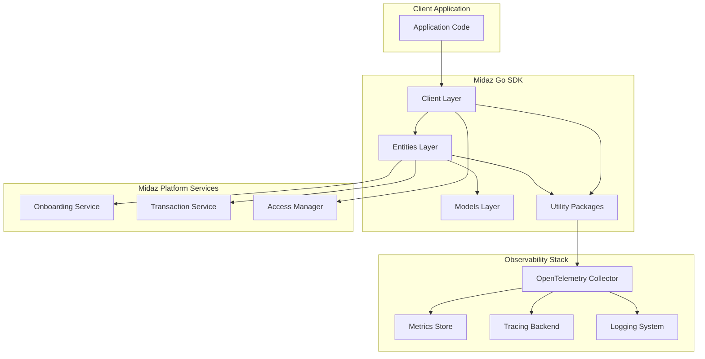

## Architectural Diagrams

### High-Level System Architecture

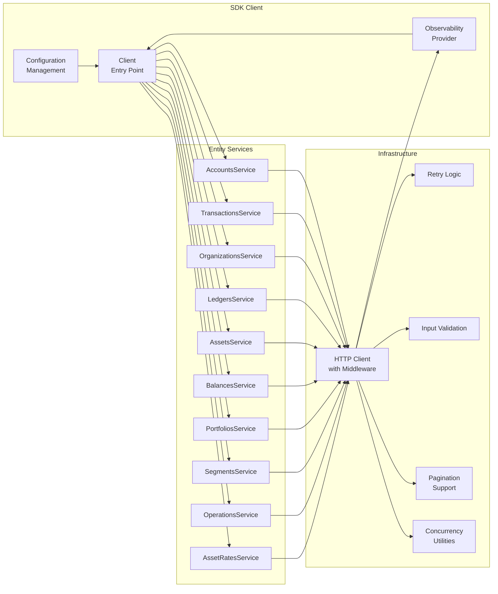

### Data Flow Architecture

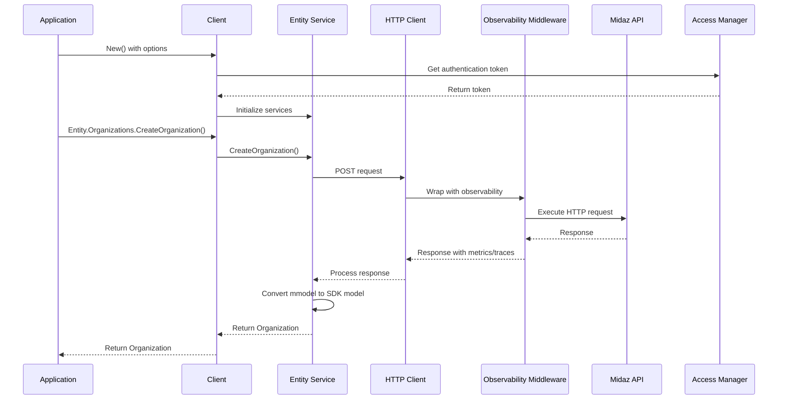

### Component Interaction Workflow

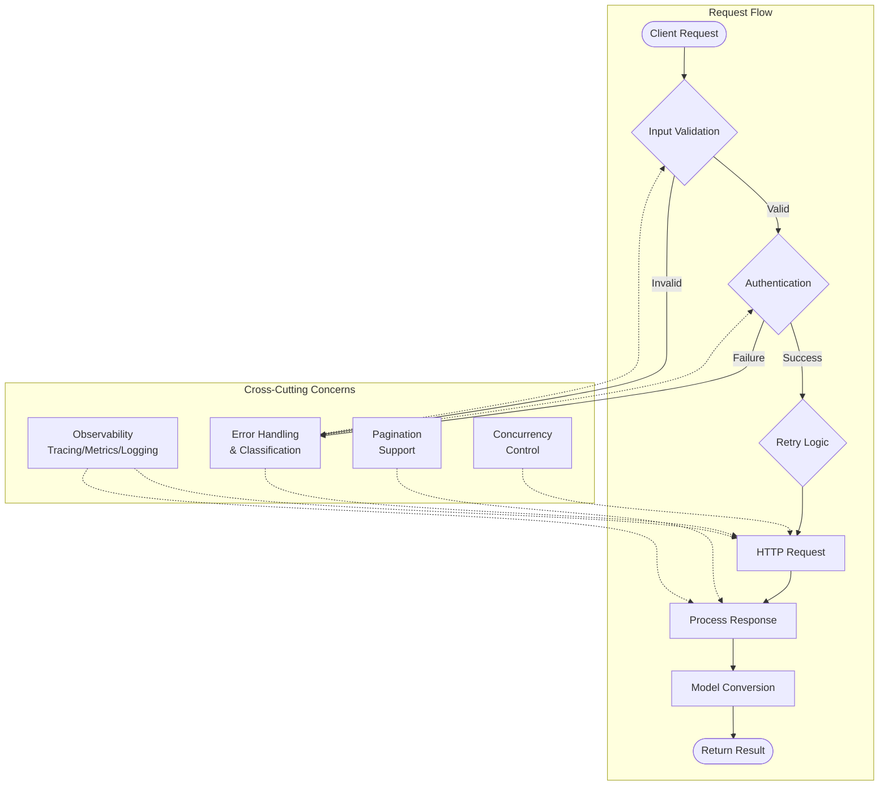

## Core Components

### 1. Client Layer (`client.go`)

**Purpose**: Top-level entry point providing unified access to all SDK functionality.

**Key Responsibilities**:

- Configuration management via functional options
- Service initialization and lifecycle management
- Observability provider setup and context management
- Authentication token management
- Graceful shutdown coordination

**Key Methods**:

- `New(options ...Option) (*Client, error)`: Main constructor with functional options
- `WithEnvironment(env Environment)`: Environment configuration
- `WithObservability(tracing, metrics, logging bool)`: Observability setup
- `UseAllAPIs()`: Enable all service interfaces
- `Shutdown(ctx context.Context)`: Graceful resource cleanup

**Location**: `/client.go:23-674`

### 2. Entity Layer (`entities/`)

**Purpose**: Service-specific interfaces providing direct API access with proper abstraction.

**Key Components**:

- **Entity Factory** (`entities/entity.go`): Central access point to all services
- **Service Interfaces**: Strongly-typed interfaces for each domain
- **HTTP Client** (`entities/http.go`): Configured HTTP client with middleware
- **Model Conversion**: Bridge between SDK models and backend models

**Service Interfaces**:

- `AccountsService`: Account creation, retrieval, balance management
- `TransactionsService`: Transaction processing (standard & DSL)
- `OrganizationsService`: Organization lifecycle management
- `LedgersService`: Ledger creation and management
- `AssetsService`: Asset definition and configuration
- And 5 additional specialized services

**Location**: `/entities/entity.go:32-378`

### 3. Models Layer (`models/`)

**Purpose**: Data structures representing all Midaz platform resources with validation.

**Key Features**:

- **Type Safety**: Strongly-typed structs for all resources
- **Validation**: Built-in validation using the validation package
- **Conversion Methods**: Bidirectional conversion with backend models (`mmodel`)
- **Builder Patterns**: Fluent APIs for model construction
- **JSON Serialization**: Proper JSON tags and custom marshaling

**Core Models**:

- `Account`: Financial account with balances and metadata
- `Transaction`: Financial transaction with operations
- `Organization`: Business entity owning ledgers
- `Ledger`: Collection of accounts and transactions
- `Asset`: Financial instrument definitions
- Plus 5 additional domain models

**Location**: `/models/model.go:1-50`

## Data Models

### Entity Relationship Diagram

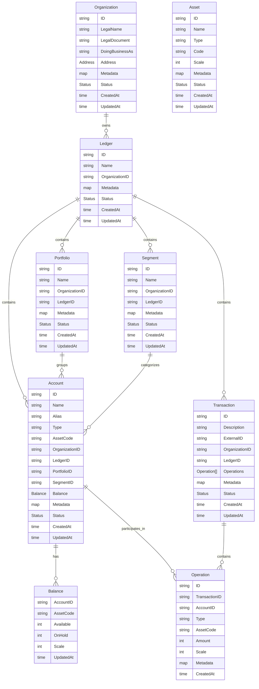

### Data Flow Patterns

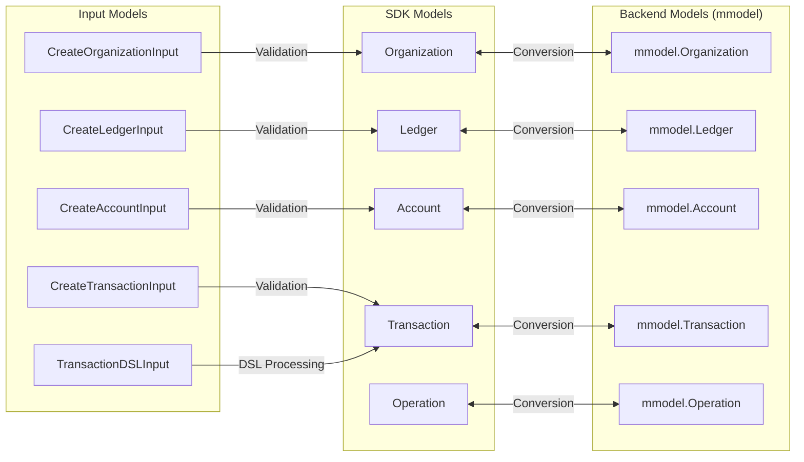

## Service Interfaces

### Complete API Surface

#### OrganizationsService

```go
type OrganizationsService interface {
    // CRUD Operations
    CreateOrganization(ctx context.Context, input *models.CreateOrganizationInput) (*models.Organization, error)
    GetOrganization(ctx context.Context, id string) (*models.Organization, error)
    UpdateOrganization(ctx context.Context, id string, input *models.UpdateOrganizationInput) (*models.Organization, error)
    DeleteOrganization(ctx context.Context, id string) error
    ListOrganizations(ctx context.Context, opts *models.ListOptions) (*models.ListResponse[models.Organization], error)
}
```

#### LedgersService

```go
type LedgersService interface {
    CreateLedger(ctx context.Context, organizationID string, input *models.CreateLedgerInput) (*models.Ledger, error)
    GetLedger(ctx context.Context, organizationID, id string) (*models.Ledger, error)
    UpdateLedger(ctx context.Context, organizationID, id string, input *models.UpdateLedgerInput) (*models.Ledger, error)
    DeleteLedger(ctx context.Context, organizationID, id string) error
    ListLedgers(ctx context.Context, organizationID string, opts *models.ListOptions) (*models.ListResponse[models.Ledger], error)
}
```

#### AccountsService

```go
type AccountsService interface {
    CreateAccount(ctx context.Context, organizationID, ledgerID string, input *models.CreateAccountInput) (*models.Account, error)
    GetAccount(ctx context.Context, organizationID, ledgerID, id string) (*models.Account, error)
    GetAccountByAlias(ctx context.Context, organizationID, ledgerID, alias string) (*models.Account, error)
    UpdateAccount(ctx context.Context, organizationID, ledgerID, id string, input *models.UpdateAccountInput) (*models.Account, error)
    DeleteAccount(ctx context.Context, organizationID, ledgerID, id string) error
    ListAccounts(ctx context.Context, organizationID, ledgerID string, opts *models.ListOptions) (*models.ListResponse[models.Account], error)
    GetBalance(ctx context.Context, organizationID, ledgerID, accountID string) (*models.Balance, error)
}
```

#### TransactionsService

```go
type TransactionsService interface {
    // Standard Transaction Processing
    CreateTransaction(ctx context.Context, orgID, ledgerID string, input *models.CreateTransactionInput) (*models.Transaction, error)

    // DSL Transaction Processing
    CreateTransactionWithDSL(ctx context.Context, orgID, ledgerID string, input *models.TransactionDSLInput) (*models.Transaction, error)
    CreateTransactionWithDSLFile(ctx context.Context, orgID, ledgerID string, dslContent []byte) (*models.Transaction, error)

    // Retrieval and Management
    GetTransaction(ctx context.Context, orgID, ledgerID, transactionID string) (*models.Transaction, error)
    ListTransactions(ctx context.Context, orgID, ledgerID string, opts *models.ListOptions) (*models.ListResponse[models.Transaction], error)
    UpdateTransaction(ctx context.Context, orgID, ledgerID, transactionID string, input any) (*models.Transaction, error)
}
```

#### Additional Services

- **AssetsService**: Asset definition and management
- **BalancesService**: Account balance queries and history
- **PortfoliosService**: Account grouping and portfolio management
- **SegmentsService**: Account categorization and segment management
- **OperationsService**: Individual transaction operation management
- **AssetRatesService**: Currency exchange rate management

## Utility Packages

### Configuration (`pkg/config/`)

**Purpose**: Centralized configuration management with environment support.

**Key Features**:

- Environment-based URL resolution (local, development, production)
- Functional options pattern for type-safe configuration
- Environment variable integration
- Service URL mapping and validation
- Plugin authentication configuration

**Location**: `/pkg/config/config.go:78-752`

### Observability (`pkg/observability/`)

**Purpose**: OpenTelemetry integration for comprehensive monitoring.

**Capabilities**:

- Distributed tracing with span management
- Metrics collection (request counts, latencies, errors)
- Structured logging with context propagation
- HTTP middleware for automatic instrumentation
- OTLP exporters for traces and metrics
- Custom metric collectors for SDK operations

**Location**: `/pkg/observability/observability.go:1-50`

### Concurrency (`pkg/concurrent/`)

**Purpose**: Utilities for high-performance parallel processing with resilience features.

**Features**:

- Worker pools with configurable concurrency levels
- Circuit breaker pattern for protecting downstream services
- Rate limiting and backpressure handling
- Batch processing utilities with HTTP batch adapters
- Result collection and error aggregation
- Context-aware cancellation and timeout management
- Unordered result processing for maximum throughput
- Failure threshold monitoring and automatic recovery

**Key Components**:

- `WorkerPool`: Configurable parallel processing with worker goroutines
- `CircuitBreaker`: Automatic failure detection and service protection
- `HttpBatchAdapter`: Batch HTTP request processing for efficiency
- `RateLimiter`: Token bucket algorithm for request throttling

**Location**: `/pkg/concurrent/concurrent.go:1-50`

### Retry Logic (`pkg/retry/`)

**Purpose**: Resilient operation execution with intelligent backoff.

**Capabilities**:

- Exponential backoff with configurable parameters
- Jitter for distributed system stability
- Context-aware cancellation
- Configurable retry conditions
- HTTP-specific retry logic
- Integration with observability for retry metrics

**Location**: `/pkg/retry/retry.go:1-50`

### Validation (`pkg/validation/`)

**Purpose**: Comprehensive input validation with helpful error messages.

**Features**:

- DSL transaction validation
- Asset code and type validation
- Account alias and metadata validation
- Address validation with regional support
- Date range validation
- Configurable validation rules
- Field-level error reporting with suggestions

**Location**: `/pkg/validation/validation.go:1-50`

### Data Generation Framework (`pkg/generator/`)

**Purpose**: Comprehensive framework for generating realistic demo data and testing scenarios.

**Key Interfaces**:

- `OrganizationGenerator`: Creates organizations with realistic business data
- `LedgerGenerator`: Generates ledgers with proper configuration and pagination support
- `AssetGenerator`: Creates assets with scale configuration and rate management
- `AccountGenerator`: Generates accounts with hierarchy and type relationships
- `TransactionGenerator`: Creates transactions using DSL patterns and batch processing
- `TransactionLifecycle`: Manages pending/commit/revert transaction states

**Advanced Features**:

- Concurrent generation with worker pools and circuit breakers
- Template-based data creation with realistic patterns
- Account type integration (checking, savings, credit, expense, revenue, liability, equity)
- Operation route and transaction route creation for validation
- DSL-based transaction pattern demonstrations
- Idempotency key support and external ID management

**Location**: `/pkg/generator/interfaces.go:1-73`

### Data Templates (`pkg/data/`)

**Purpose**: Provides templates and patterns for realistic data generation.

**Template Types**:

- `OrgTemplate`: Organizations with legal documents, addresses, and industry metadata
- `LedgerTemplate`: Basic ledger configurations with metadata
- `AssetTemplate`: Assets with scale, type, and code specifications
- `AccountTemplate`: Account creation with type requirements and relationships
- `TransactionPattern`: DSL-based transaction patterns for complex flows

**Features**:

- Realistic business data with proper formatting
- Metadata constraints validation (100/2000 character limits)
- Support for different locales (US EIN vs Brazil CNPJ)
- Account type relationships and hierarchy support
- DSL transaction pattern templates

**Location**: `/pkg/data/templates.go:1-63`

### Integrity Verification (`pkg/integrity/`)

**Purpose**: Balance verification and double-entry accounting validation.

**Capabilities**:

- Balance aggregation per asset across all accounts
- Available and on-hold balance tracking
- Overdrawn account detection (negative available balances)
- Double-entry consistency validation
- Internal net total computation (excluding @external/ accounts)
- Scale consistency verification for currency amounts
- Optional account lookup throttling for large ledgers

**Key Types**:

- `BalanceTotals`: Aggregated balance data per asset
- `Report`: Comprehensive integrity report for ledgers
- `Checker`: Main integrity verification engine

**Location**: `/pkg/integrity/checker.go:1-219`

### Statistics & Monitoring (`pkg/stats/`)

**Purpose**: Statistics collection, performance monitoring, and metrics aggregation.

**Features**:

- Real-time performance metrics collection
- API call statistics and timing
- Transaction volume tracking
- Entity creation monitoring
- TPS (Transactions Per Second) calculation
- Progress monitoring with ETA estimation

**Location**: `/pkg/stats/stats.go:1-50`

### Data Generation & Testing Utilities

- **Generator** (`pkg/generator/`): Comprehensive data generation framework with interfaces for creating realistic demo data
- **Data** (`pkg/data/`): Templates and patterns for organizations, accounts, assets, and transactions
- **Integrity** (`pkg/integrity/`): Balance verification, double-entry validation, and data consistency checks
- **Stats** (`pkg/stats/`): Statistics collection, performance monitoring, and metrics aggregation

### Additional Core Utilities

- **Pagination** (`pkg/pagination/`): Generic pagination support for all list operations with cursor and offset modes
- **Errors** (`pkg/errors/`): Structured error handling with classification and detailed field-level error reporting
- **Format** (`pkg/format/`): Date/time formatting and standardization utilities
- **Performance** (`pkg/performance/`): Batch processing, JSON optimization, and high-throughput operations
- **Conversion** (`pkg/conversion/`): Type conversion utilities between SDK models and backend models
- **Transaction** (`pkg/transaction/`): Transaction processing helpers, batch operations, and reporting utilities
- **Utils** (`pkg/utils/`): General utility functions for UUID generation, validation, and common operations
- **Accounts** (`pkg/accounts/`): Account management utilities separate from the entities layer

## Design Patterns

### 1. Functional Options Pattern

Used extensively throughout the SDK for type-safe, extensible configuration:

```go
// Client configuration
client, err := client.New(
    client.WithEnvironment(config.EnvironmentProduction),
    client.WithObservability(true, true, true),
    client.WithRetries(3, 1*time.Second, 30*time.Second),
    client.UseAllAPIs(),
)

// Configuration options
cfg, err := config.NewConfig(
    config.WithEnvironment(config.EnvironmentLocal),
    config.WithAccessManager(accessManager),
    config.WithTimeout(30 * time.Second),
)
```

### 2. Interface Segregation

Each domain has focused interfaces with single responsibilities:

```go
type AccountsService interface {
    // Account CRUD
    CreateAccount(...) (*models.Account, error)
    GetAccount(...) (*models.Account, error)
    // ... other account operations
}

type TransactionsService interface {
    // Transaction operations only
    CreateTransaction(...) (*models.Transaction, error)
    CreateTransactionWithDSL(...) (*models.Transaction, error)
    // ... other transaction operations
}
```

### 3. Factory Pattern

Centralized service creation and configuration:

```go
// Entity factory
entity := &Entity{
    Accounts:      NewAccountsEntity(client, token, urls),
    Transactions:  NewTransactionsEntity(client, token, urls),
    Organizations: NewOrganizationsEntity(client, token, urls),
    // ... other services
}
```

### 4. Builder Pattern

Fluent APIs for model construction:

```go
account := models.NewAccount().
    WithName("Customer Account").
    WithType("customer").
    WithAssetCode("USD").
    WithMetadata(map[string]any{
        "customer_id": "cust-123",
        "tier": "premium",
    })
```

### 5. Middleware Pattern

HTTP request/response processing pipeline:

```go
// Observability middleware
transport := observability.NewHTTPMiddleware(provider)(http.DefaultTransport)

// Retry middleware
transport = retry.NewHTTPMiddleware(retryOptions)(transport)

// Authentication middleware
transport = auth.NewHTTPMiddleware(authProvider)(transport)
```

## API Surface Documentation

### External APIs (Client-Facing)

#### Client Construction

```go
func New(options ...Option) (*Client, error)
func WithConfig(cfg *config.Config) Option
func WithEnvironment(env config.Environment) Option
func WithObservability(tracing, metrics, logging bool) Option
func UseAllAPIs() Option
```

#### Service Access

```go
// Through client
client.Entity.Organizations.CreateOrganization(...)
client.Entity.Accounts.CreateAccount(...)
client.Entity.Transactions.CreateTransaction(...)

// Direct entity creation
entity, err := entities.NewWithServiceURLs(serviceURLs, options...)
```

#### Configuration

```go
cfg, err := config.NewConfig(
    config.WithEnvironment(config.EnvironmentProduction),
    config.WithAccessManager(accessManager),
    config.FromEnvironment(), // Load from env vars
)
```

### Internal APIs (Package Interfaces)

#### Model Conversion

```go
// SDK model to backend model
mmodelOrg := org.ToMmodelOrganization()

// Backend model to SDK model
org := models.FromMmodelOrganization(mmodelOrg)
```

#### HTTP Client Interface

```go
type HTTPClient interface {
    Do(req *http.Request) (*http.Response, error)
    WithRetryOption(option retry.Option)
    SetAuthToken(token string)
}
```

#### Observability Interface

```go
type Provider interface {
    Tracer(name string) trace.Tracer
    Meter(name string) metric.Meter
    Logger() Logger
    IsEnabled() bool
    Shutdown(ctx context.Context) error
}
```

## Data Flow Analysis

### Complete Transaction Workflow

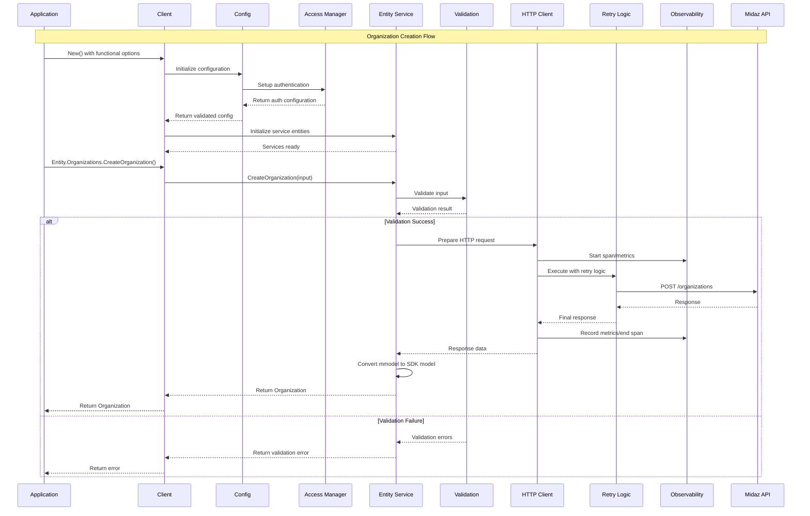

### Account Balance Query Flow

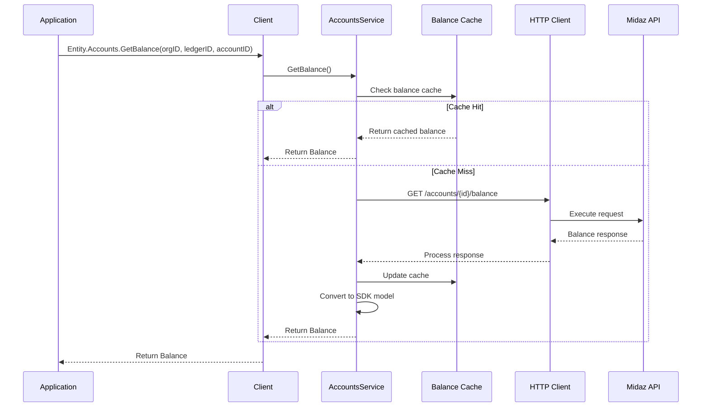

## Authentication & Security

### Plugin-Based Authentication Architecture

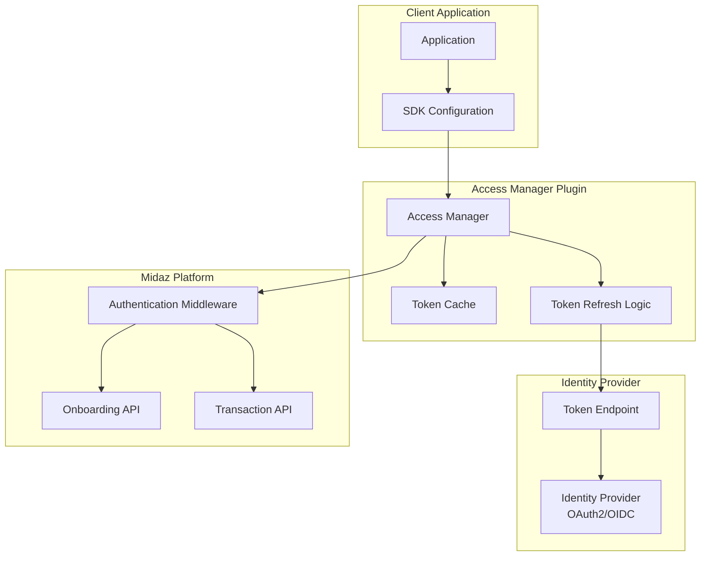

### Security Features

1. **Token Management**:

   - Automatic token refresh
   - Secure token storage
   - Token expiration handling

2. **Request Security**:

   - HTTPS enforcement
   - Request signing (where applicable)
   - Idempotency key generation

3. **Error Security**:
   - Sensitive data scrubbing from logs
   - Error message sanitization
   - PII protection in traces

**Configuration**:

```go
accessManager := auth.AccessManager{
    Enabled:      true,
    Address:      "https://auth.example.com",
    ClientID:     os.Getenv("CLIENT_ID"),
    ClientSecret: os.Getenv("CLIENT_SECRET"),
}
```

## Observability & Monitoring

### OpenTelemetry Integration

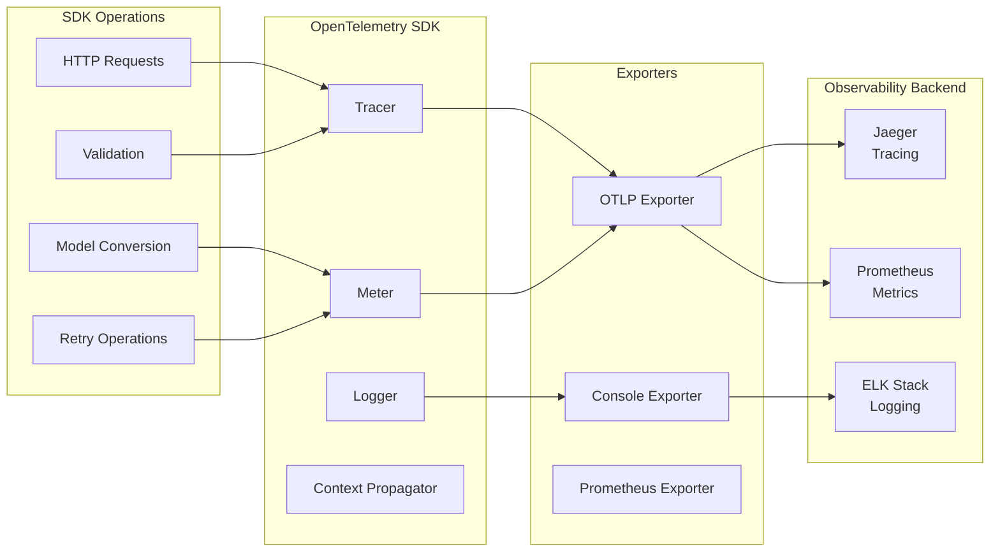

### Metrics Collected

**Request Metrics**:

- `midaz.sdk.request.total`: Total requests by service/operation
- `midaz.sdk.request.duration`: Request latency percentiles
- `midaz.sdk.request.error.total`: Error count by type

**Operation Metrics**:

- `midaz.sdk.validation.duration`: Validation time
- `midaz.sdk.conversion.duration`: Model conversion time
- `midaz.sdk.retry.attempts`: Retry attempt counts

**Resource Metrics**:

- `midaz.sdk.account.operations`: Account operations
- `midaz.sdk.transaction.operations`: Transaction operations
- `midaz.sdk.organization.operations`: Organization operations

## Configuration Management

### Environment-Based Configuration

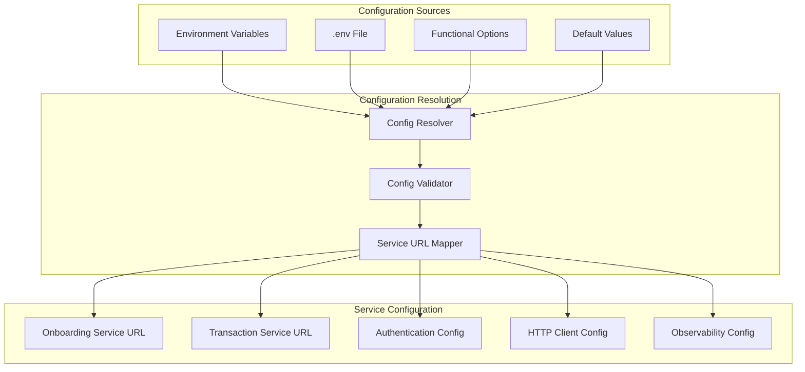

### Environment Support

**Local Development**:

```
MIDAZ_ENVIRONMENT=local
MIDAZ_ONBOARDING_URL=http://localhost:3000/v1
MIDAZ_TRANSACTION_URL=http://localhost:3001/v1
```

**Development/Staging**:

```
MIDAZ_ENVIRONMENT=development
MIDAZ_BASE_URL=https://api.dev.midaz.io
```

**Production**:

```
MIDAZ_ENVIRONMENT=production
MIDAZ_BASE_URL=https://api.midaz.io
```

## Error Handling Strategy

### Error Classification

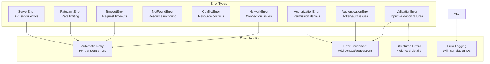

### Error Response Structure

```go
type SDKError struct {
    Type        ErrorType         `json:"type"`
    Message     string           `json:"message"`
    Code        string           `json:"code,omitempty"`
    Details     ErrorDetails     `json:"details,omitempty"`
    FieldErrors []FieldError     `json:"field_errors,omitempty"`
    Suggestions []string         `json:"suggestions,omitempty"`
    TraceID     string           `json:"trace_id,omitempty"`
    Retryable   bool            `json:"retryable"`
}

type FieldError struct {
    Field   string `json:"field"`
    Message string `json:"message"`
    Code    string `json:"code,omitempty"`
    Value   any    `json:"value,omitempty"`
}
```

## Performance & Concurrency

### Concurrency Patterns

**Worker Pool Pattern**:

```go
// Process 1000 transactions with 10 workers
results := concurrent.WorkerPool(ctx, transactions,
    func(ctx context.Context, tx Transaction) (Result, error) {
        return processTransaction(ctx, tx)
    },
    concurrent.WithWorkers(10),
    concurrent.WithBufferSize(100),
    concurrent.WithRateLimit(500), // 500 ops/sec
)
```

**Batch Processing**:

```go
// Process accounts in batches of 50
results := concurrent.Batch(ctx, accounts, 50,
    func(ctx context.Context, batch []Account) ([]Result, error) {
        return client.BulkUpdateAccounts(ctx, batch)
    },
    concurrent.WithWorkers(5),
)
```

### Performance Optimizations

1. **Connection Pooling**: Reusable HTTP connections
2. **Response Streaming**: Large response streaming support
3. **JSON Optimization**: Custom JSON marshaling for performance
4. **Memory Management**: Object pooling for frequently used structures
5. **Caching**: Response caching for read-heavy operations

## Extension Points

### Custom Middleware

```go
// Custom HTTP middleware
type CustomMiddleware struct {
    next http.RoundTripper
}

func (m *CustomMiddleware) RoundTrip(req *http.Request) (*http.Response, error) {
    // Custom logic before request
    resp, err := m.next.RoundTrip(req)
    // Custom logic after response
    return resp, err
}
```

### Custom Observability Provider

```go
type CustomObservabilityProvider struct {
    // Custom implementation
}

func (p *CustomObservabilityProvider) Tracer(name string) trace.Tracer {
    // Custom tracer implementation
}

// Use custom provider
client, err := client.New(
    client.WithObservabilityProvider(customProvider),
    client.UseAllAPIs(),
)
```

### Custom Validation Rules

```go
validator, err := validation.NewValidator(
    validation.WithCustomRule("account_type", func(value any) error {
        // Custom validation logic
        return nil
    }),
    validation.WithStrictMode(true),
)
```

## Deployment & Environment Support

### Environment Configuration Matrix

| Environment | Onboarding URL                | Transaction URL                | Authentication | Debug        |
| ----------- | ----------------------------- | ------------------------------ | -------------- | ------------ |
| Local       | `localhost:3000/v1`           | `localhost:3001/v1`            | Optional       | Enabled      |
| Development | `api.dev.midaz.io/onboarding` | `api.dev.midaz.io/transaction` | Required       | Configurable |
| Production  | `api.midaz.io/onboarding`     | `api.midaz.io/transaction`     | Required       | Disabled     |

### Container Deployment

```dockerfile
FROM golang:1.24-alpine AS builder
WORKDIR /app
COPY . .
RUN go mod tidy && go build -o app

FROM alpine:latest
RUN apk --no-cache add ca-certificates
COPY --from=builder /app/app /usr/local/bin/app
CMD ["app"]
```

### Kubernetes Configuration

```yaml
apiVersion: apps/v1
kind: Deployment
metadata:
  name: midaz-sdk-app
spec:
  template:
    spec:
      containers:
        - name: app
          image: midaz-sdk-app:latest
          env:
            - name: MIDAZ_ENVIRONMENT
              value: "production"
            - name: MIDAZ_CLIENT_ID
              valueFrom:
                secretKeyRef:
                  name: midaz-credentials
                  key: client-id
            - name: PLUGIN_AUTH_ENABLED
              value: "true"
```

## Example Applications & Demonstrations

The SDK includes comprehensive example applications demonstrating various usage patterns and advanced features.

### Mass Demo Generator (`examples/mass-demo-generator/`)

A comprehensive demo data generation application showcasing advanced SDK capabilities:

**Key Features**:

- **Concurrent Processing**: Parallel entity creation with configurable worker pools
- **Circuit Breaker Integration**: Automatic API protection with failure detection
- **DSL Transaction Patterns**: Complex transaction flows using domain-specific language
- **Routing System**: Complete account types, operation routes, and transaction routes
- **Integrity Verification**: Balance checks and double-entry validation
- **Comprehensive Reporting**: Detailed HTML and JSON reports with performance metrics

**Generated Data Structure**:

1. Organizations with realistic business data and addresses
2. Ledgers with proper metadata and configuration
3. Assets including fiat currencies, cryptocurrencies, and loyalty points
4. Account types (checking, savings, credit, expense, revenue, liability, equity)
5. Accounts with hierarchical relationships and type associations
6. Portfolios and segments for account organization
7. Operation routes and transaction routes for validation
8. Transactions using both standard operations and DSL patterns

**Performance Characteristics**:

- Configurable concurrency levels (1-50 workers)
- Circuit breaker protection with failure thresholds
- Rate limiting and throttling capabilities
- Real-time progress monitoring with TPS metrics
- Batch processing optimization for high throughput

### Other Examples

- **`workflow-with-entities/`**: Complete end-to-end workflow implementation
- **`concurrency-example/`**: Concurrent operations and balance fetching
- **`observability-demo/`**: Observability and monitoring setup
- **`configuration-examples/`**: SDK configuration patterns and best practices
- **`validation-example/`**: Input validation and error handling patterns
- **`retry-example/`**: Retry mechanisms and error handling

---

**Document Version**: 1.1  
**Last Updated**: 2025-09-28  
**SDK Version**: 2.0.0  
**Architecture Review Status**: ✅ Complete
