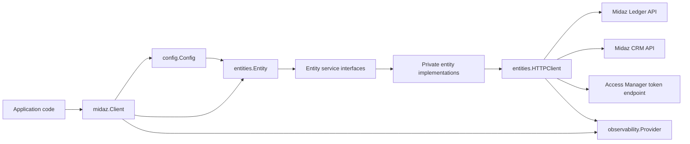
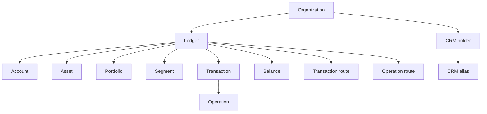
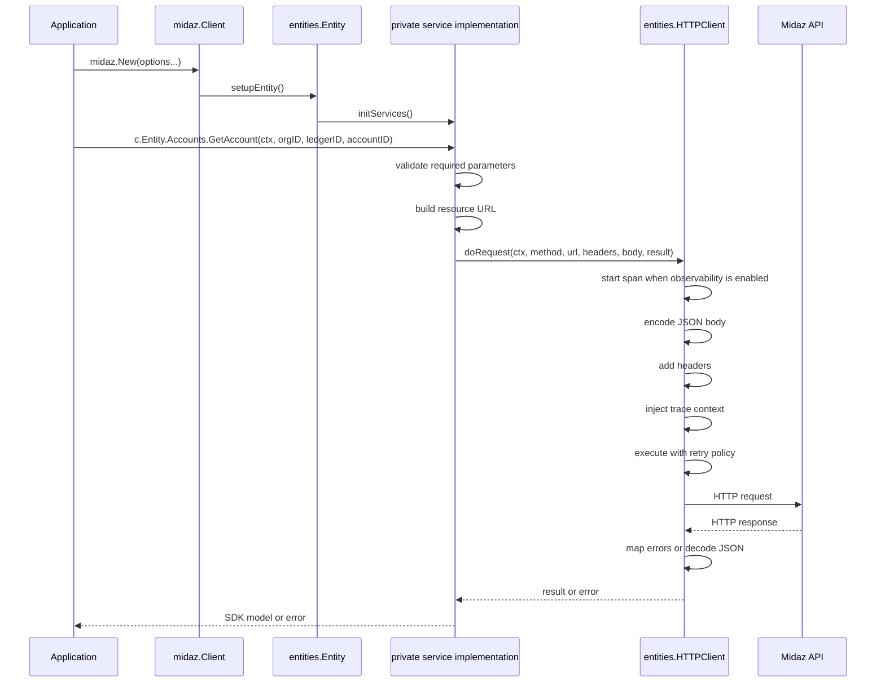

# Midaz Go SDK architecture

This document explains how the current Midaz Go SDK is organized, how requests move through the SDK, and which extension points are available. It focuses on the implemented codebase, not planned architecture.

The SDK is an idiomatic Go client for Midaz Ledger and CRM APIs. The root module is `github.com/LerianStudio/midaz-sdk-golang/v3`, and the root package name is `midaz` in `midaz.go`.

## Architecture at a glance

The SDK uses a layered request path:

```text
Application code
  -> midaz.Client
  -> config.Config
  -> entities.Entity
  -> private entity implementations
  -> entities.HTTPClient
  -> Midaz Ledger API / Midaz CRM API
```


```mermaid
flowchart LR
    App[Application code] --> Client[midaz.Client]
    Client --> Config[config.Config]
    Client --> Entity[entities.Entity]

    Config --> Entity
    Entity --> Services[Entity service interfaces]
    Services --> Impl[Private entity implementations]
    Impl --> HTTP[entities.HTTPClient]

    HTTP --> Ledger[Midaz Ledger API]
    HTTP --> CRM[Midaz CRM API]
    HTTP --> Access[Access Manager token endpoint]

    Client --> Obs[observability.Provider]
    HTTP --> Obs
```

The major layers are:

- **Root client layer**: Owns top-level configuration, context, observability, retry settings, tenant defaults, and service initialization.
- **Config layer**: Resolves URLs, HTTP client settings, retry settings, Access Manager settings, idempotency, and environment-based options.
- **Entity layer**: Exposes the 16 service interfaces through `c.Entity`.
- **Private entity implementations**: Build resource-specific URLs, validate required inputs, call the HTTP layer, and map responses into SDK models.
- **HTTP layer**: Handles JSON encoding, request construction, headers, authorization, retries, idempotency, response decoding, error mapping, and trace propagation.
- **Model layer**: Provides public request and response types, fluent builders, list options, list responses, aliases, and validation helpers.
- **Utility packages**: Provide configuration, structured errors, observability, retry, pagination, validation, security, formatting, concurrency, generation, and transaction helpers.

## Project structure

```text
.
├── midaz.go
├── entities/
├── models/
├── pkg/
├── examples/
├── docs/
├── scripts/
├── Makefile
├── go.mod
└── .env.example
```

| Path | Purpose |
| --- | --- |
| `midaz.go` | Root SDK entry point. Defines package `midaz`, `Client`, `New`, client options, service initialization, observability access, shutdown, and small model constructors. |
| `entities/` | Entity service interfaces, private HTTP-backed implementations, entity factory, request context helpers, URL builders, and transport helpers. |
| `models/` | Public SDK types, request inputs, fluent builders, list responses, pagination options, CRM models, transaction models, and Midaz model aliases. |
| `pkg/config/` | SDK configuration, service URL resolution, environment reading, HTTP client setup, Access Manager config, retry defaults, and idempotency flags. |
| `pkg/auth/` | Access Manager client-credentials token request support. |
| `pkg/errors/` | Structured SDK error type, categories, codes, constructors, and helper checkers. |
| `pkg/observability/` | OpenTelemetry provider abstraction, tracing, metrics, logging, context propagation, and HTTP helpers. |
| `pkg/retry/` | Retry options, retry engine, HTTP retry helpers, exponential backoff, jitter, and retryable status/error matching. |
| `pkg/security/` | Outbound request validation and related safety checks. |
| `pkg/validation/` | Validation helpers and field-level validation structures. |
| `pkg/concurrent/` | Worker pool, batching, and rate-limit utilities. |
| `pkg/transaction/` | Transaction batching and transaction helper workflows. |
| `pkg/generator/`, `pkg/data/`, `pkg/integrity/`, `pkg/stats/` | Demo data, transaction generation, integrity checks, and statistics helpers used by examples and tooling. |
| `examples/` | Runnable examples for configuration, Access Manager, tracing, retries, validation, concurrency, and end-to-end workflows. |
| `docs/` | Hand-written guides and generated Go documentation. |

The module currently declares Go `1.26.0` in `go.mod`.

## Client lifecycle

You create a client with `midaz.New(...)`. The constructor starts with default settings, applies options in order, validates configuration, and initializes services.

```go
cfg, err := config.NewConfig(config.FromEnvironment())
if err != nil {
    return err
}

c, err := midaz.New(
    midaz.WithConfig(cfg),
    midaz.WithAnonymous(),
)
if err != nil {
    return err
}
defer c.Shutdown(context.Background())
```

`midaz.New(...)` initializes entity services when configuration validates. Pass `midaz.WithAccessManager(...)` for production-shaped OAuth or `midaz.WithAnonymous()` for auth-less local stacks.

The initialization path is:

1. `midaz.New` creates a `Client` with default background context, disabled default observability provider, and `config.DefaultConfig()`.
2. Client options update the `Client` and its config.
3. `setupEntity()` reads service URLs, attaches observability, propagates debug/user-agent/tenant settings, creates the entity layer, and configures retry and idempotency behavior.
4. `entities.NewEntityWithConfig(...)` reads Access Manager settings, fetches an Access Manager token if enabled, creates an `entities.HTTPClient`, stores service URLs, applies entity options, and initializes services.
5. `entities.Entity.initServices()` creates all private service implementations and propagates the parent HTTP client configuration into each service-specific HTTP client.

## Configuration

The SDK has two configuration entry points:

- `config.DefaultConfig()` for internal defaults before client options are applied.
- `config.NewConfig(...)` for validated application configuration.

Default config values include:

| Setting | Default |
| --- | --- |
| Environment | `local` |
| Timeout | `60s` |
| User agent | from `pkg/version.UserAgent()` |
| Max retries | `3` |
| Retry wait minimum | `1s` at the config layer |
| Retry wait maximum | `30s` at the config layer |
| Retries enabled | `true` |
| Idempotency enabled | `true` |
| Local Ledger base URL | `http://localhost:3002/v1` |
| Local CRM base URL | `http://localhost:4003/v1` |

The HTTP retry engine has its own default options in `pkg/retry`:

| Retry option | Default |
| --- | --- |
| Max retries | `3` |
| Initial delay | `100ms` |
| Max delay | `10s` |
| Backoff factor | `2.0` |
| Jitter factor | `0.25` |

When you configure the root client with `midaz.WithRetries(max, min, maxBackoff)`, `setupEntity()` applies those values to the entity HTTP client.

## Environment variables

The SDK does not load `.env` files by itself.

`config.FromEnvironment()` reads values from the current process environment only. If you want to use a `.env` file, load it before creating the SDK config, or use shell exports, Docker environment variables, or your process manager.

```go
cfg, err := config.NewConfig(config.FromEnvironment())
if err != nil {
    return err
}
```

Supported environment variables read by `config.FromEnvironment()` are:

| Variable | Behavior |
| --- | --- |
| `MIDAZ_ENVIRONMENT` | Sets `local`, `development`, or `production`. |
| `PLUGIN_AUTH_ENABLED` | Enables Access Manager token fetching when set to `true`. |
| `PLUGIN_AUTH_ADDRESS` | Sets the Access Manager base address. |
| `MIDAZ_CLIENT_ID` | Sets the Access Manager client ID. |
| `MIDAZ_CLIENT_SECRET` | Sets the Access Manager client secret. |
| `MIDAZ_USER_AGENT` | Overrides the user-agent string. |
| `MIDAZ_BASE_URL` | Sets a shared base URL. The SDK derives Ledger and CRM service URLs from it. |
| `MIDAZ_ONBOARDING_URL` | Overrides the onboarding service URL. |
| `MIDAZ_TRANSACTION_URL` | Overrides the transaction service URL. |
| `MIDAZ_CRM_URL` | Overrides the CRM service URL. |
| `MIDAZ_TIMEOUT` | Sets HTTP timeout in seconds. |
| `MIDAZ_DEBUG` | Enables debug mode when set to `true`. |
| `MIDAZ_MAX_RETRIES` | Sets maximum retry attempts. |
| `MIDAZ_IDEMPOTENCY` | Enables or disables automatic idempotency behavior when set. |

The current config reader does not read `MIDAZ_RETRY_WAIT_MIN`, `MIDAZ_RETRY_WAIT_MAX`, `MIDAZ_OTEL_ENDPOINT`, or `MIDAZ_LOG_LEVEL`. Configure retry timing and observability programmatically when you need those settings.

## Service URL resolution

The config package uses three service names internally:

| Service name | Purpose |
| --- | --- |
| `onboarding` | Ledger API resources historically grouped under onboarding, such as organizations, ledgers, accounts, assets, portfolios, and segments. |
| `transaction` | Ledger API transaction-side resources, such as transactions, operations, balances, routes, metadata indexes, and asset rates. |
| `crm` | CRM resources, currently holders and aliases. |

For local defaults:

- Ledger API uses `http://localhost:3002/v1`
- CRM API uses `http://localhost:4003/v1`

For development and production defaults, CRM falls back to the Ledger base URL unless you provide `MIDAZ_CRM_URL` or `config.WithCRMURL(...)`.

`midaz.WithBaseURL(...)` derives service URLs from a shared base:

- Ledger services use port `3002` for localhost without an explicit port.
- CRM uses port `4003` for localhost without an explicit port.
- The SDK appends `/v1` when the path does not already end in `/v1`.

## Entity services

The root client exposes entity services after `midaz.New(...)` validates configuration and initializes the entity layer.

```go
c, err := midaz.New(
    midaz.WithBaseURL("http://localhost"),
    midaz.WithAnonymous(),
)
if err != nil {
    return err
}

orgs, err := c.Entity.Organizations.ListOrganizations(ctx, models.NewListOptions().WithLimit(20))
```

The current entity surface has 16 services:

| Service | API area | Backing URL key | Purpose |
| --- | --- | --- | --- |
| `Organizations` | Ledger | `onboarding` | Manage organizations. |
| `Ledgers` | Ledger | `onboarding` | Manage ledgers inside organizations. |
| `Accounts` | Ledger | mostly `onboarding`, balance helper uses `transaction` | Manage accounts and account-level balance helpers. |
| `AccountTypes` | Ledger | `onboarding` | Manage account types. |
| `Assets` | Ledger | `onboarding` | Manage assets. |
| `AssetRates` | Ledger | `transaction` | Manage asset rate resources. |
| `Balances` | Ledger | `transaction` | Read and manage balance resources. |
| `Operations` | Ledger | `transaction` | Read account-based and transaction-based operations. |
| `OperationRoutes` | Ledger | `transaction` | Manage operation routes. |
| `Transactions` | Ledger | `transaction` | Create, list, update, commit, cancel, and revert transactions. |
| `TransactionRoutes` | Ledger | `transaction` | Manage transaction routes. |
| `MetadataIndexes` | Ledger | `transaction` | Manage metadata indexes. |
| `Portfolios` | Ledger | `onboarding` | Manage portfolios. |
| `Segments` | Ledger | `onboarding` | Manage segments. |
| `Holders` | CRM | `crm` | Manage CRM holders. |
| `Aliases` | CRM | `crm` | Manage CRM aliases and related parties. |

Each public service field is an interface. Each concrete implementation is private to the `entities` package, such as `accountsEntity`, `transactionsEntity`, `holdersEntity`, and `aliasesEntity`.

## Conceptual resource hierarchy

The SDK does not define a database schema. The following hierarchy is conceptual and describes how SDK methods scope requests.


```mermaid
flowchart TD
    Org[Organization] --> Ledger[Ledger]
    Ledger --> Account[Account]
    Ledger --> Asset[Asset]
    Ledger --> Portfolio[Portfolio]
    Ledger --> Segment[Segment]
    Ledger --> Transaction[Transaction]
    Transaction --> Operation[Operation]
    Ledger --> Balance[Balance]
    Ledger --> TransactionRoute[Transaction route]
    Ledger --> OperationRoute[Operation route]
    Org --> Holder[CRM holder]
    Holder --> Alias[CRM alias]
```

Use the model types in `models/` as the source of truth for SDK request and response fields. Avoid treating conceptual diagrams as field-level ER diagrams.

## Request lifecycle

A normal SDK request follows this path:


```mermaid
sequenceDiagram
    participant App as Application
    participant Client as midaz.Client
    participant Entity as entities.Entity
    participant Service as private service implementation
    participant HTTP as entities.HTTPClient
    participant API as Midaz API

    App->>Client: midaz.New(options...)
    Client->>Entity: setupEntity()
    Entity->>Service: initServices()

    App->>Service: c.Entity.Accounts.GetAccount(ctx, orgID, ledgerID, accountID)
    Service->>Service: validate required parameters
    Service->>Service: build resource URL
    Service->>HTTP: doRequest(ctx, method, url, headers, body, result)
    HTTP->>HTTP: start span when observability is enabled
    HTTP->>HTTP: encode JSON body
    HTTP->>HTTP: add headers
    HTTP->>HTTP: inject trace context
    HTTP->>HTTP: execute with retry policy
    HTTP->>API: HTTP request
    API-->>HTTP: HTTP response
    HTTP->>HTTP: map errors or decode JSON
    HTTP-->>Service: result or error
    Service-->>App: SDK model or error
```

The HTTP layer adds these standard headers:

| Header | Behavior |
| --- | --- |
| `Accept: application/json` | Added to requests. |
| `Content-Type: application/json` | Added when the request has a body and no custom content type is set. |
| `User-Agent` | Uses config user agent or version default. |
| `Authorization: Bearer <token>` | Added only when an Access Manager token is available or an entity has an auth token. |
| `X-Idempotency` | Added from context or transaction input when present. Some transaction requests can request automatic generation. |
| `X-Tenant-ID` | Added from request context or client/config default tenant ID when present. |
| `X-Organization-Id` | Added by CRM holder and alias requests. |

The tenant header is compatibility metadata. The reference Midaz path treats authenticated claims as the primary tenant source of truth.

## Access Manager authentication

Access Manager support lives in `pkg/auth`.

The SDK supports client-credentials token fetching through:

```go
import auth "github.com/LerianStudio/midaz-sdk-golang/v3/pkg/auth"

cfg, err := config.NewConfig(
    config.WithAccessManager(auth.AccessManager{
        Enabled:      true,
        Address:      "https://access-manager.example.com",
        ClientID:     "midaz-client",
        ClientSecret: "secret",
    }),
)
if err != nil {
    return err
}

c, err := midaz.New(
    midaz.WithConfig(cfg),
)
```

When Access Manager is enabled, `entities.NewEntityWithConfig(...)` calls:

```go
auth.GetTokenFromAccessManager(context.Background(), pluginAuth, config.GetHTTPClient())
```

The token request is a `POST` to:

```text
{PLUGIN_AUTH_ADDRESS}/v1/login/oauth/access_token
```

The request payload is:

```json
{
  "grantType": "client_credentials",
  "clientId": "...",
  "clientSecret": "..."
}
```

The SDK uses the returned `accessToken` as a bearer token on entity HTTP requests.

Important boundaries:

- The SDK fetches the token during entity setup.
- The SDK does not refresh tokens automatically.
- The SDK does not use the `refreshToken` field from the Access Manager response.
- The SDK does not sign individual requests.
- The SDK does not claim to derive tenant scope from tokens. It only sends optional tenant headers when configured.

## Errors

Most SDK operational errors use `*errors.Error` from `github.com/LerianStudio/midaz-sdk-golang/v3/pkg/errors`.

The actual error shape is:

```go
type Error struct {
    Category   ErrorCategory
    Code       ErrorCode
    APICode    string
    Title      string
    Message    string
    Operation  string
    Resource   string
    ResourceID string
    EntityType string
    Fields     []string
    Details    map[string]any
    StatusCode int
    RequestID  string
    Err        error
}
```

`*errors.Error` implements:

- `Error() string`
- `Unwrap() error`
- `Is(target error) bool`

Use the helper checkers for common branches:

```go
import sdkerrors "github.com/LerianStudio/midaz-sdk-golang/v3/pkg/errors"

account, err := c.Entity.Accounts.GetAccount(ctx, orgID, ledgerID, accountID)
if err != nil {
    switch {
    case sdkerrors.IsNotFoundError(err):
        return fmt.Errorf("account not found: %w", err)
    case sdkerrors.IsAuthenticationError(err):
        return fmt.Errorf("authentication failed: %w", err)
    case sdkerrors.IsRateLimitError(err):
        return fmt.Errorf("rate limited: %w", err)
    default:
        return fmt.Errorf("get account: %w", err)
    }
}
```

Use `errors.As` from the standard library when you need fields such as operation, resource, API code, status code, request ID, or structured API details:

```go
var sdkErr *sdkerrors.Error
if stderrors.As(err, &sdkErr) {
    log.Printf(
        "category=%s code=%s operation=%s status=%d request_id=%s",
        sdkErr.Category,
        sdkErr.Code,
        sdkErr.Operation,
        sdkErr.StatusCode,
        sdkErr.RequestID,
    )
}
```

Remote API field details are preserved on `pkg/errors.Error.Fields` and `pkg/errors.Error.Details` when the API returns them. Local client-side validation helpers can also return `pkg/validation.FieldErrors`.

## Retry behavior

Retry support lives in `pkg/retry` and is applied by `entities.HTTPClient`.

The default retryable HTTP status codes are:

| Status | Meaning |
| --- | --- |
| `408` | Request timeout |
| `429` | Too many requests |
| `500` | Internal server error |
| `502` | Bad gateway |
| `503` | Service unavailable |
| `504` | Gateway timeout |

Default retryable network error text includes:

- `connection reset by peer`
- `connection refused`
- `timeout`
- `deadline exceeded`
- `too many requests`
- `rate limit`
- `service unavailable`

Configure retries at the client level:

```go
c, err := midaz.New(
    midaz.WithRetries(3, 100*time.Millisecond, 10*time.Second),
    midaz.WithAnonymous(),
)
```

Disable retries:

```go
c, err := midaz.New(
    midaz.DisableRetries(),
    midaz.WithAnonymous(),
)
```

You can also provide a custom retry predicate:

```go
c, err := midaz.New(
    midaz.WithCustomRetryPolicy(func(resp *http.Response, err error) bool {
        if resp != nil && resp.StatusCode == http.StatusConflict {
            return false
        }

        return err != nil
    }),
    midaz.WithAnonymous(),
)
```

The custom predicate decides whether retry processing continues for a response or error. It does not replace request construction, response decoding, or SDK error mapping.

## Idempotency behavior

The SDK is conservative about retries for unsafe HTTP methods.

Unsafe methods are:

- `POST`
- `PUT`
- `PATCH`
- `DELETE`

If an unsafe request has no `X-Idempotency` header, the HTTP layer sets the effective retry count to `0` for that request. This prevents automatic retries from duplicating state-changing operations.

You can attach an idempotency key to any request context:

```go
ctx := sdkctx.WithIdempotencyKey(context.Background(), "payment-2026-04-27-0001")

tx, err := c.Entity.Transactions.CreateTransaction(ctx, orgID, ledgerID, input)
```

For transaction creation, `models.CreateTransactionInput` also has an idempotency field used by the transaction service:

```go
input := models.NewCreateTransactionInput("USD", "100.00").
    WithDescription("Customer payment").
    WithSend(&models.SendInput{
        Asset: "USD",
        Value: "100.00",
        Source: &models.SourceInput{
            From: []models.FromToInput{
                {Account: customerAlias, Amount: models.AmountInput{Asset: "USD", Value: "100.00"}},
            },
        },
        Distribute: &models.DistributeInput{
            To: []models.FromToInput{
                {Account: merchantAlias, Amount: models.AmountInput{Asset: "USD", Value: "100.00"}},
            },
        },
    })

input.IdempotencyKey = "payment-2026-04-27-0001"

tx, err := c.Entity.Transactions.CreateTransaction(ctx, orgID, ledgerID, input)
```

Automatic idempotency applies to unsafe entity HTTP requests. The HTTP layer auto-generates `X-Idempotency` when:

1. idempotency is enabled,
2. the method is unsafe,
3. no idempotency key is already present.

The HTTP layer removes internal idempotency marker headers before the request is sent. Unsafe retries still require a caller-provided key; SDK-generated keys provide server-side deduplication but do not enable unsafe retries by themselves.

## Observability

Observability lives in `pkg/observability`.

The public provider interface is:

```go
type Provider interface {
    Tracer() trace.Tracer
    Meter() metric.Meter
    Logger() Logger
    Shutdown(ctx context.Context) error
    IsEnabled() bool
}
```

The root client creates a disabled provider by default. You can enable or inject observability with:

```go
provider, err := observability.New(context.Background(),
    observability.WithServiceName("payments-api"),
    observability.WithServiceVersion("1.0.0"),
    observability.WithEnvironment("production"),
    observability.WithComponentEnabled(true, true, true),
    observability.WithCollectorEndpoint("localhost:4317"),
)
if err != nil {
    return err
}
defer provider.Shutdown(context.Background())

c, err := midaz.New(
    midaz.WithObservabilityProvider(provider),
    midaz.WithAnonymous(),
)
```

`observability.WithCollectorEndpoint(...)` configures OTLP gRPC exporters. Pass the endpoint as `host:port`, such as:

```text
localhost:4317
otel-collector:4317
```

Do not include `http://` or `https://` in the OTLP gRPC endpoint value.

When the corresponding observability components are enabled, outbound entity requests can:

- create HTTP spans when tracing is enabled,
- inject W3C trace context and baggage into request headers using the configured provider propagator,
- record request metrics through `MetricsCollector` when metrics are enabled,
- use the provider logger for SDK warnings or errors when logging is enabled,
- emit safe structured business events for lifecycle operations such as account creation and transaction commit/cancel flows.

`entities.HTTPClient` is the default SDK HTTP instrumentation point. Root client observability options attach the provider to the entity layer rather than wrapping the transport by default, which avoids duplicate client spans. Incoming HTTP applications should call `observability.ExtractHTTPContext(observability.WithProvider(r.Context(), provider), r.Header)` before invoking SDK methods so the application span, SDK span, and Midaz API span stay in one trace even when `observability.WithRegisterGlobally(false)` is used.

Business logs are allowlisted. Safe identifiers such as `organizationId`, `ledgerId`, `assetId`, `accountId`, `transactionId`, `operationId`, `portfolioId`, `segmentId`, `balanceId`, `holderId`, `aliasId`, `routeId`, `status`, `operation`, and `event` may appear in logs and span events. Payloads, metadata, documents, names, addresses, auth headers, idempotency keys, secrets, and raw request/response bodies are not logged.

The SDK does not read `MIDAZ_OTEL_ENDPOINT` or `MIDAZ_LOG_LEVEL` in `config.FromEnvironment()`. Configure observability in code.

## Models and validation

The `models` package contains public SDK types. These types are the boundary between application code and entity services.

Common model responsibilities include:

- request input types such as `CreateOrganizationInput`, `CreateAccountInput`, and `CreateTransactionInput`
- fluent builders such as `models.NewCreateOrganizationInput(...)`
- response types such as `Organization`, `Ledger`, `Account`, `Transaction`, `Holder`, and `Alias`
- list options and list responses
- pagination metadata helpers
- CRM holder and alias models
- transaction DSL and send-based transaction inputs
- validation methods on selected input types
- conversion helpers between SDK models and Midaz backend model shapes

Validation happens primarily in model `Validate()` methods and service-level required parameter checks. The SDK does not provide a runtime system for custom validation rule registration.

## Pagination

List methods use `models.ListOptions` and `models.ListResponse[T]`.

```go
options := models.NewListOptions().
    WithLimit(50).
    WithPage(1).
    WithFilter("status", "ACTIVE")

accounts, err := c.Entity.Accounts.ListAccounts(ctx, orgID, ledgerID, options)
if err != nil {
    return err
}

for _, account := range accounts.Items {
    fmt.Println(account.ID)
}

if accounts.Pagination.HasNextPage() {
    nextOptions := accounts.Pagination.NextPageOptions()
    _ = nextOptions
}
```

Cursor support is endpoint-specific. `WithCursor(...)` sets the cursor query parameter, and transaction listing has explicit cursor-aware behavior.

## CRM support

CRM support is implemented through two entity services:

- `Holders`
- `Aliases`

CRM requests use the `crm` service URL and send the organization context through:

```text
X-Organization-Id: <organizationID>
```

If a default tenant ID is configured, the shared HTTP client may also send `X-Tenant-ID`. That header does not replace the CRM `organizationID`; holder and alias methods still require `organizationID` and send it as `X-Organization-Id`. Per-request `entities.WithTenantID(ctx, id)` overrides only the default tenant header.

Example:

```go
holders, err := c.Entity.Holders.ListHolders(
    ctx,
    orgID,
    models.NewListOptions().WithLimit(20),
)
if err != nil {
    return err
}

alias, err := c.Entity.Aliases.CreateAlias(
    ctx,
    orgID,
    holderID,
    &models.CreateAliasInput{
        LedgerID:  ledgerID,
        AccountID: accountID,
        Metadata: map[string]any{
            "label": "primary account alias",
        },
    },
)
```

If no CRM URL is configured, the entity layer falls back to the onboarding URL. For local development, prefer setting `MIDAZ_CRM_URL=http://localhost:4003/v1` or using `midaz.WithCRMURL(...)`.

## Security boundaries

The SDK includes outbound request validation in `pkg/security`. The HTTP layer validates parsed request URLs before executing requests.

The SDK also redacts sensitive values in debug logging, including:

- `Authorization`
- cookies
- `X-Idempotency`
- `X-Tenant-ID`

Debug mode logs request and response metadata. Request and response bodies are redacted by length rather than printed directly.

## What the SDK does not provide

The current codebase does not implement these features:

- automatic `.env` loading inside the SDK
- automatic token refresh
- request signing
- custom validation rule registration
- response streaming APIs
- SDK-level caching
- non-existent client middleware constructors
- field-level ER diagrams as a source of truth
- automatic observability configuration from environment variables

Use application code or infrastructure around the SDK when you need those capabilities.

## Local development

Create a local `.env` from the example when you want shell-based configuration:

```bash
make set-env
```

The SDK still reads only the process environment. If your application uses `.env`, load it before calling `config.NewConfig(config.FromEnvironment())`.

Run the main verification commands:

```bash
go build ./...
go test ./...
make verify-sdk
```

Use `make ci` for the full local pipeline when you need linting, security scanning, tests, coverage, and SDK compatibility checks.

## Docker guidance for examples and applications

This repository is a Go library, not a single long-running service. A Dockerfile for the repository should either:

1. build all packages to validate the library, or
2. build a specific runnable example application.

For library validation, use:

```dockerfile
FROM golang:1.26 AS build

WORKDIR /src
COPY go.mod go.sum ./
RUN go mod download

COPY . .
RUN go build ./...
```

For a runnable example, target an example with a `main` package:

```dockerfile
FROM golang:1.26 AS build

WORKDIR /src
COPY go.mod go.sum ./
RUN go mod download

COPY . .
RUN go build -o /out/mass-demo-generator ./examples/mass-demo-generator

FROM gcr.io/distroless/base-debian12:nonroot
WORKDIR /app
COPY --from=build /out/mass-demo-generator /usr/local/bin/mass-demo-generator
COPY --from=build /src/examples/mass-demo-generator/default.yaml /app/default.yaml
USER nonroot:nonroot
ENTRYPOINT ["/usr/local/bin/mass-demo-generator"]
```

Pass SDK configuration through environment variables at runtime:

```bash
docker run --rm \
  -e MIDAZ_BASE_URL=https://midaz.example.com \
  -e MIDAZ_CRM_URL=https://crm.midaz.example.com/v1 \
  -e PLUGIN_AUTH_ENABLED=false \
  midaz-mass-demo-generator
```

Do not create Docker guidance that assumes the library itself starts a server.

## Extension points

Use these supported extension points:

| Need | Extension point |
| --- | --- |
| Custom service URLs | `midaz.WithBaseURL`, `midaz.WithOnboardingURL`, `midaz.WithTransactionURL`, `midaz.WithCRMURL`, or config equivalents. |
| Custom HTTP behavior | `midaz.WithHTTPClient(...)` or `config.WithHTTPClient(...)`. |
| Retry tuning | `midaz.WithRetries(...)`, `midaz.DisableRetries()`, or `midaz.WithCustomRetryPolicy(...)`. |
| Access Manager authentication | `config.WithAccessManager(...)` or `config.FromEnvironment()`. |
| Observability | `midaz.WithObservabilityProvider(...)`, `midaz.WithObservabilityOptions(...)`, or `midaz.WithCollectorEndpoint(...)`. |
| Tenant compatibility header | `midaz.WithTenantID(...)`, `config.WithTenantID(...)`, or `sdkctx.WithRequestTenantID(ctx, ...)`. |
| Per-request idempotency | `sdkctx.WithIdempotencyKey(ctx, ...)` or transaction input idempotency. |
| Pagination | `models.NewListOptions()` and `models.ListResponse[T]` pagination helpers. |
| Error branching | `pkg/errors` helper checkers and `errors.As`. |

## Next steps

- Use `README.md` for quick-start usage.
- Use `docs/environment.md` for environment variable details.
- Use `docs/errors.md` for error handling patterns.
- Use `docs/pagination.md` for list and cursor behavior.
- Use `docs/tracing.md` for OpenTelemetry examples.
- Use `docs/mapping/external_apis.md` for the public SDK surface.
- Use generated Go docs from `make docs` or `make godoc` when you need package-level API details.
